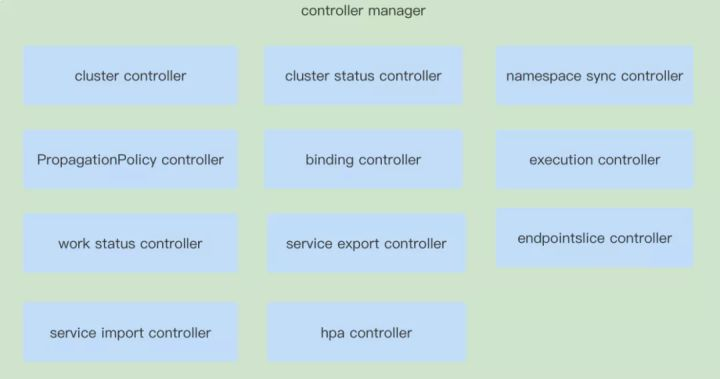
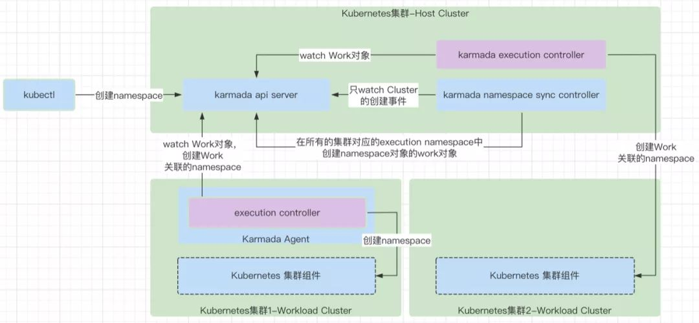
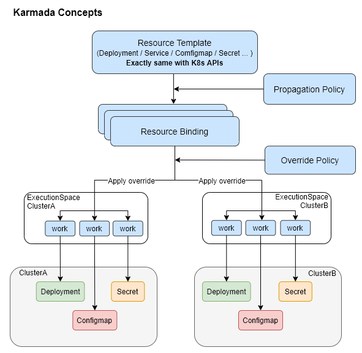
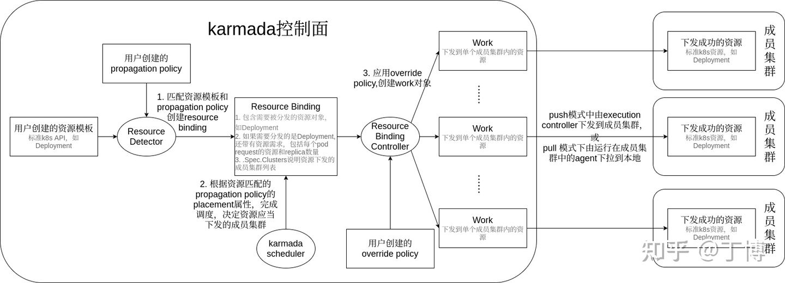
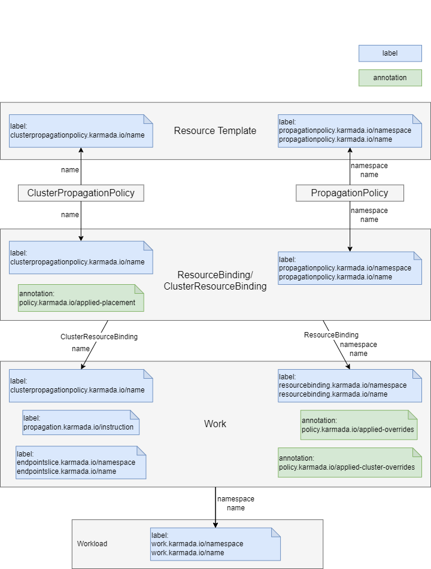

```sh
karmadactl init \
    --kube-image-mirror-country=cn \
    --etcd-data=/data/kam-etcd \
    --etcd-image=registry.cn-hangzhou.aliyuncs.com/google_containers/etcd:3.5.3-0 \
    --karmada-aggregated-apiserver-image=docker.io/karmada/karmada-aggregated-apiserver:v1.2.1 \
    --karmada-controller-manager-image=docker.io/karmada/karmada-controller-manager:v1.2.1 \
    --karmada-scheduler-image=docker.io/karmada/karmada-scheduler:v1.2.1 \
    --karmada-webhook-image=docker.io/karmada/karmada-webhook:v1.2.1
```

## 链接
* https://bbs.huaweicloud.com/blogs/349802
* http://www.sel.zju.edu.cn/blog/2021/09/13/%E4%BB%8Ekarmada-api%E8%A7%92%E5%BA%A6%E5%88%86%E6%9E%90%E5%A4%9A%E4%BA%91%E7%8E%AF%E5%A2%83%E4%B8%8B%E7%9A%84%E5%BA%94%E7%94%A8%E8%B5%84%E6%BA%90%E7%BC%96%E6%8E%92%E8%AE%BE%E8%AE%A1%E4%B8%8E%E5%AE%9E%E7%8E%B0/

## 是什么？
华为牵头出品的和kubefed v1 v2 有交流合作的多集群k8s联邦管理系统(联邦控制器)。

上手难度：中等略难受，因为karmada v1.2.1的官网文档不够新。

* #### 比kubefed强在哪里？
    * karmada提供k8s原生yaml支持，kubefed有改造成本必须写它的CRD
    * karmada支持跨集群的HPA水平动态伸缩，kubfed没有提到这个功能
    * karmada支持用agent方式去控制非公网的k8s集群，kubefed没有提到这种pull的模式，这点在安全性上来说，让联邦的host集群变得危险，因为它需要让agent能连得上联邦集群内的 aggregated apiserver。

* #### 架构设计
    以下内容摘自 https://bbs.huaweicloud.com/blogs/349802 和官方文档

    

    11种控制器来支撑联邦资源的下发与监控

    

    * #### Cluster Controller
        cluster controller主要就是处理Cluster资源对象的逻辑，负责处理Cluster对应需要的关联资源。

    * #### Cluster status controller
        cluster status controller主要就是处理cluster status资源对象的逻辑，用来收集Cluster的状态，保存到Cluster的status字段中，同步上报到Karmada的控制平面中。

    * #### namespace sync controller
        namespace sync controller主要就是处理namespace资源对象的逻辑，负责将Karmada控制平面创建的namespace在集群中同步创建出来。

    * #### Resourse Template controller
        detector模块中包含了通用controller负责resource template的Kubernetes资源对象的调和处理逻辑，以及匹配PropagationPolicy。主要就是处理PropagationPolicy资源对象的逻辑，来派生出资源对象对应的ResourceBinding对象。

    * #### Binding controller
        binding controller主要就是处理ResourceBinding资源对象的增删改逻辑，ResourceBinding的调和能力是派生出work对象，work对象是和特定集群关联的。一个work只能属于一个集群，代表一个集群的资源对象的模型封装。

    * #### execution controller
        execution controller主要就是处理Work资源对象的增删改逻辑，用于处理Work，将Work负责的Kubernetes资源对象在对应的集群上创建出来。

    * #### work status controller
        work status controller主要就是处理Work资源对象的状态逻辑，负责收集Work的状态，也就是Work对应的资源对象的状态，只是这个状态是保存在Work的status字段里的。

    * #### serviceexport controller
        serviceexport controller主要就是处理serviceexport资源对象的状态逻辑，将需要被其它集群发现的服务暴露出来。

    * #### endpointslice controller
        endpointslice controller主要根据serviceexport资源对象对应到处的Service，Service对应的endpointslice上报到Karmada的控制面。

    * #### serviceimport controller
        serviceimport controller主要负责根据ServiceExport暴露出来的Service，在自己负责的集群中创建对应的service，注意service的名称不是完全一样的，同时在自己负责的集群中也创建对应的EndpointSlice，这个EndpointSlice的数据就是来源于EndpointSlice controller中上报到karmada控制平面的EndpointSlice对象，具体是通过在karmada-webhook中给ServiceImport的PropagationPolicy中增加了EndpointSlice的下发能力。

    * #### hpa controller
        hpa controller主要负责将Karmada控制面中创建的HPA对象通过创建Work的方式下发到对应的集群中。

* ### 特色功能
    * #### 集群故障转移
        参阅 https://karmada.io/docs/userguide/failover

        基于host集群karmada-cluster空间内的的租约对象Lease和集群CRD yaml的 .status 字段来判定集群是否不正常，集群租约续期默认10秒一次。

## 通信模式

* #### push模式
    karmada直接访问被管集群的apiserver并获取资源状态以及下发集群工作负载资源
* #### pull模式
    karmada不再访问被管集群的apiserver，而是由一个运行在每个集群上的karmada agent的pod来负责上报集群状态和接收karmada控制面发来的工作负载,也就是agent去pull和本集群绑定的联邦资源。

## 实现原理
图片来自官方文档



* #### Resource Template
    对应了联邦概念定义中的Template，用于表示联邦资源，不过和kubefed不同的是，karmada中的联邦资源都是原声k8s yaml，不是像kubefed一样的CRD，这样非常利于部署，没有改造成本。

* #### Propagation Policy
    传播策略定义了资源下发策略，比如要下发到哪个集群中去、
    ```yaml
    apiVersion: policy.karmada.io/v1alpha1
    kind: PropagationPolicy
    metadata:
    name: example-policy # The default namespace is `default`.
    spec:
    resourceSelectors:
        - apiVersion: apps/v1
        kind: Deployment
        name: nginx # If no namespace is specified, the namespace is inherited from the parent object scope.
    placement:
        clusterAffinity:
        clusterNames:
            - member1
    ```

    此外还有一个叫做 ClusterPropagationPolicy 的同级别的东西，和 PropagationPolicy 的区别是， PropagationPolicy 仅用于带namespace的k8s 资源，而 ClusterPropagationPolicy可以用于不带namespace的k8s资源如ClusterRole这种集群级的资源。

* #### ResourceBinding
    资源绑定，用于描述 Resource Template 和 Propagation Policy 的绑定关系，含有CRD ResourceBinding和ClusterResourceBinding，代码参阅pkg/controllers/binding
* #### OverridePolicy
    重写策略定义了将联邦资源下发到各个member集群时要做的定制化处理，比如更改容器镜像的仓库前缀之类的
    ```yaml
    apiVersion: apps/v1
    kind: Deployment
    metadata:
    name: myapp
    ...
    spec:
    template:
        spec:
        containers:
            - image: myapp
            name: myapp
            command:
                - ./myapp
                - --parameter1=foo
                - --parameter2=bar
    ---
    apiVersion: policy.karmada.io/v1alpha1
    kind: OverridePolicy
    metadata:
    name: example
    spec:
    ...
    overriders:
        commandOverrider:
        - containerName: myapp
            operator: add
            value:
            - --cluster=member1
    ```
* #### ExecutionSpace
    执行空间，work控制器，主要是将联邦资源实际地创建到member集群上，如果是push模式则execution space 存在于host集群，如果是pull模式则存在于member集群的agent内。

## 下发工作流程


## 对象绑定流程


## 跨集群的服务
条件非常苛刻，需要借助 多集群服务 API（Multi-Cluster Services API），还需要将各个member集群的容器网络打通。可以考虑用rancher的Submariner来完成多集群容器网络打通。 https://github.com/submariner-io/submariner

安装好 MCS https://github.com/kubernetes-sigs/mcs-api 的 ServiceExport and ServiceImport CRD 到每个member集群

参阅 https://github.com/karmada-io/karmada/blob/master/docs/multi-cluster-service.md

* ### ServiceExport
    * #### 描述
    定义了将同空间下同名的core v1 Service 暴露为联邦服务的方法。

    https://github.com/kubernetes/enhancements/tree/master/keps/sig-multicluster/1645-multi-cluster-services-api#design-details

* ### EndpointSlice
    * 稳定版本 在k8s v1.21 https://pkg.go.dev/k8s.io/api/discovery/v1#Endpoint
    * 中文简介 https://blog.51cto.com/u_15127573/4227833
    * 官方介绍 https://kubernetes.io/docs/concepts/services-networking/endpoint-slices/
    * #### 描述
        被设计来解决传统的core/v1 Endpoints 端点过多导致性能问题的情况。增加了如下字段：
        * hostname 端点名称,自己填，需要全小写以套用为dns路径
        * zone 集群所处区域字段
        * node 节点字段
        * ready pod状态字段，只有pod状态为Ready时EndpointSlice的ready字段才会为true
        * serving 和ready字段完全相同，当 terminating 字段为true时本字段将消失
        ```yaml
        apiVersion: discovery.k8s.io/v1
        kind: EndpointSlice
        metadata:
        name: example-abc
        labels:
            kubernetes.io/service-name: example
        addressType: IPv4
        ports:
        - name: http
            protocol: TCP
            port: 80
        endpoints:
        - addresses:
            - "10.1.2.3"
            conditions:
            ready: true
            serving: true
            # terminating: false
            hostname: pod-1
            nodeName: node-1
            zone: us-west2-a
        ```
    * #### 大致过程
        https://github.com/kubernetes-sigs/mcs-api 

        pkg/controllers/service.go 将

## 跨集群的ingress
条件非常苛刻，需要借助 多集群服务 API（Multi-Cluster Services API），还需要将各个member集群的容器网络打通。可以考虑用rancher的Submariner来完成多集群容器网络打通。 https://github.com/submariner-io/submariner

当使用多集群服务MCS的时候，还需要将host集群和各个member集群的网络打通以方便流量能够互通。

安装好 MCS https://github.com/kubernetes-sigs/mcs-api 的 ServiceExport and ServiceImport CRD 到每个member集群

参阅 https://github.com/karmada-io/karmada/blob/master/docs/multi-cluster-ingress.md

## 额外
* ### 多集群一致性？
    没有保证，只保证资源能够6/3个，但是get pod无效 也就是没法看pod状态了

    

* ### 坑：
1. 需要禁止CNI配置文件/etc/cni/* 上的ipv6的支持，否则karmada会起不来etcd
2. CNI不能开IPV6支持，否则karmada的etcd起不来
3. 不能用默认命令行，官网文档在骗人，需要将镜像切换成 docker.io/karmada
4. 不能在docker-destop上搭建，因为docker-desktop 的IP是假的导致无法连接karmada的apiserver