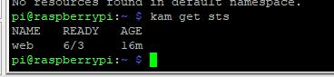

karmadactl init \
    --kube-image-mirror-country=cn \
    --etcd-data=/data/kam-etcd \
    --etcd-image=registry.cn-hangzhou.aliyuncs.com/google_containers/etcd:3.5.3-0 \
    --karmada-aggregated-apiserver-image=docker.io/karmada/karmada-aggregated-apiserver:v1.2.1 \
    --karmada-controller-manager-image=docker.io/karmada/karmada-controller-manager:v1.2.1 \
    --karmada-scheduler-image=docker.io/karmada/karmada-scheduler:v1.2.1 \
    --karmada-webhook-image=docker.io/karmada/karmada-webhook:v1.2.1

## 是什么？
华为出品的和kubefed v1 v2 有交流合作的多集群k8s联邦管理系统。
上手难度：中等略难受，因为karmada v1.2.1的官网文档不靠谱。有些得自己猜和看源码。

架构设计？

工作流程？

push模式？
karmada直接访问被管集群的apiserver并获取资源状态以及下发集群工作负载资源
pull模式？
karmada不在访问被管集群的apiserver，而是由一个运行在每个集群上的karmada agent的pod来负责上报集群状态和接收karmada控制面发来的工作负载

能解决什么问题？

比kubefed强在哪里？

多集群一致性？
    没有保证，只保证资源能够

6/3个  ，但是get pod无效 也就是没法看pod状态了，deploy控制器 绝对魔改了 不然不可能支持6/3的写法。 

坑：
需要禁止CNI配置文件/etc/cni/* 上的ipv6的支持，否则karmada会起不来etcd
1.CNI不能开IPV6支持，否则karmada的etcd起不来
2.不能用默认命令行，官网文档在骗人，需要将镜像切换成 docker.io/karmada
3.不能在docker-destop上搭建，因为docker-desktop 的IP是假的导致无法连接karmada的apiserver