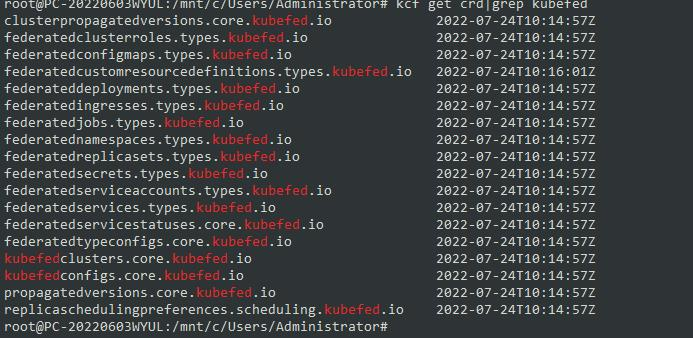
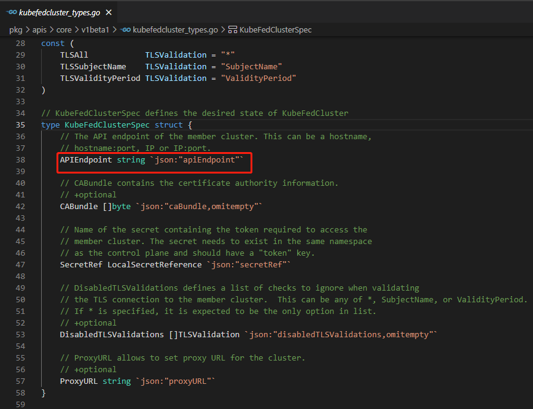

kubefedctl join docker-desktop --cluster-context docker-desktop \
    --host-cluster-context docker-desktop -v=2

## 介绍
基于kubefed版本 v0.9.2

kubefed v2 是 k8s官方博客中关于k8s联邦机制申明的实现。不同于kubefed v1，v2不在修改k8s源码来实现联邦的host集群，而是通过编写CRD Contaoller的方式来处理k8s资源在联邦集群内的分发。

这点不同于karmada，karmada是兼具kubefed v1和kubefed v2的特性，即修改了k8s源码导致了带有kubefed v1的弊病，也吸收了kubefed v2的CRD来描述k8s资源如何在联邦中分发的特性，根据karmada的官网描述，他们和kubefed有技术交流。

kubfed v1的设计是修改了k8s的api server代码和controller manager代码来实现对原生k8s yaml的兼容，这点在华为的karmada v1.2.1上有体现。但这种方式对k8s的官方发行版后续的api兼容性非常差，难以升级，因此才产生了kubefed v2 的这种CRD Controller来控制联邦如何分发资源的方式（这里吐槽一下kubeedge的未来，这玩意也是修改了kubelet的代码来实现的）。

不管是kubefed v1 还是 v2 ，使用限制都很多。基本只能围绕工作负载来进行,估计只能走CRD传播 这些绕路的方法来传播角色权限这些。 

但kubefed没有提及对于边缘计算的支持，也没有提到如何跨越网络边界。这点要表扬一下karmada的pull模式。 

## 核心概念

注意图中的深蓝色部分表示外部程序，浅蓝色的部分表示kubefed控制器自身的模块。

根据其源码定义,member集群必须是可达的，因为kubefed需要直接访问member集群的apiserver，这点就不如karmada了，karmada支持pull的模式，让host集群的联邦控制器不在主动访问member集群的apiserver，而是在member集群中加入代理agent软件，让agent主动联系联邦控制器以同步数据，完成联邦资源的分发。 

## 技术原理
* ### controller-manger 技术原理
    几乎就没有一个CRD控制器能脱离k8s informer cache watch 的机制。同样kubefed的controller-manager也基于这套机制来完成对联邦资源的create/update/delete事件的监听，并根据触发的事件做出相应的动作。

    简单的informer介绍参阅 https://aly.arriqaaq.com/kubernetes-informers/

    controller-manager内含五个子控制器，分别是
* ### 

## 功能目标
* 分发k8s内置工作负载，分发联邦服务，分发联邦ingress，分发联邦CRD用户自定义资源到指定的集群，也可以分发任意类型的k8s资源（动态建立FederatedTypeConfig  CRD）通过 kubefed enable 命令来激活对这种资源的分发支持,参阅 https://github.com/kubernetes-sigs/kubefed/blob/master/docs/userguide.md#federated-api-types 。 

    * 但对core/v1 api组里面Pod Service这些无法提供联邦分发支持。链接中也说明了原因，主要是没有分配具体的api组，默认为 "" 的代表core，会产生混淆。

    * 临时分发某个资源，参阅 https://github.com/kubernetes-sigs/kubefed/blob/master/docs/userguide.md#federating-a-target-resource

    * 将某个空间分发到member集群，参阅 https://github.com/kubernetes-sigs/kubefed/blob/master/docs/userguide.md#federate-a-namespace-with-contents

    * 这些分发都是操作的host集群上的k8s资源。
    
    * 禁止分发某种类型的k8s资源到member集群，https://github.com/kubernetes-sigs/kubefed/blob/master/docs/userguide.md#disabling-propagation-of-an-api-type

* 提供带权重的联邦pod资源副本控制机制，让每个member集群分配到的副本数量不一样，根据访问频率增加个集群的副本权重。

    参阅 https://github.com/kubernetes-sigs/kubefed/blob/master/docs/userguide.md#replicaschedulingpreference

* 监控联邦资源的状态，比如一个deployment被下发下去后，监控器运行状态。
    
    参阅 https://github.com/kubernetes-sigs/kubefed/blob/master/docs/userguide.md#propagation-status

    监控的异常状态和处理参阅 https://github.com/kubernetes-sigs/kubefed/blob/master/docs/userguide.md#troubleshooting-condition-status

* 联邦控制器kubefed controller-manger自身的高可用和单一的leader选举。

    参阅 https://github.com/kubernetes-sigs/kubefed/blob/master/docs/userguide.md#controller-manager-leader-election

* 集群注册，将member集群以CustomResource的方式注册到联邦集群中，让kubefed controller-manager监听器状态并控制联邦资源的分发。

    参阅 https://github.com/kubernetes-sigs/kubefed/blob/master/docs/cluster-registration.md

* 提供联邦资源下发时重写yaml功能，不同的成员集群，使用不同的yaml配置，比如不同集群使用不同镜像等等。

    参阅 https://github.com/kubernetes-sigs/kubefed/blob/master/docs/userguide.md#overrides

* 提供联邦资源下发时集群选择功能，让联邦资源明确可以下发到哪些member集群中去。

    参阅 https://github.com/kubernetes-sigs/kubefed/blob/master/docs/userguide.md#using-cluster-selector

* 垃圾回收，删除联邦资源时，删除各个member集群中的联邦资源。

    参阅 https://github.com/kubernetes-sigs/kubefed/blob/master/docs/userguide.md#deletion-policy
    
* 提供member集群中，某个命名空间的联邦资源同步功能
    
    参阅 https://github.com/kubernetes-sigs/kubefed/blob/master/docs/userguide.md#namespace-scoped-control-plane

### 特性要点
* ### 预删除清理机制
    https://github.com/kubernetes-sigs/kubefed/blob/master/docs/userguide.md#deletion-policy

    和大多数CRD控制器的预删除清理机制一样，都是添加finalizer到资源对象上，kubefed添加的finalizer标记是 kubefed.io/sync-controller 。

    内部将执行各个集群的联邦资源清理，比如某个叫nginx的deployment，但此时如果此时集群不可抵达，则无法完成删除动作。

    如果要阻止这种现象，一是可以用kubectl delete --grace-period 0 --force 的方式删除。二是 添加annotation kubefed.io/orphan: true 到联邦资源上。

* ### 成员集群联邦资源属性保留
    参阅 https://github.com/kubernetes-sigs/kubefed/blob/master/docs/userguide.md#local-value-retention

    一般情况下，联邦host集群一旦修改了联邦资源的任何能触发informer watch的update事件的yaml字段（说的就是metadata.annotations不能触发update事件），联邦控制器都会将host集群内的联邦资源字段属性同步到各个member集群中。

    如果此时，member集群的管理员单独做了yaml字段修改，则会被来自host集群的数据重新覆盖。
    
    如果要保留member集群单独对联邦资源的修改结果，则目前kubefed支持如下字段作为不同步字段，毕竟比如service的clusterIP这种东西就不可能所有集群都一样，ServiceAccount的secret每个member集群产生的token和证书也不一样。

    | Resource Type  | Fields                    | Retention   | Requirement                                                                        |
    |----------------|---------------------------|-------------|------------------------------------------------------------------------------------|
    | All            | metadata.annotations      | Always      | The annotations field is intended to be managed by controllers in member clusters. |
    | All            | metadata.finalizers       | Always      | The finalizers field is intended to be managed by controllers in member clusters.  |
    | All            | metadata.resourceVersion  | Always      | Updates require the most recent resourceVersion for concurrency control.           |
    | Scalable       | spec.replicas             | Conditional | The HPA controller may be managing the replica count of a scalable resource.       |
    | Service        | spec.clusterIP,spec.ports | Always      | A controller may be managing these fields.                                         |
    | ServiceAccount | secrets                   | Conditional | A controller may be managing this field.                                           |

## 缺点
* 不支持按资源余量调度。
* 不支持原生k8s对象，这对于已经存在大规模原生k8s yaml应用的公司来说是个灾难