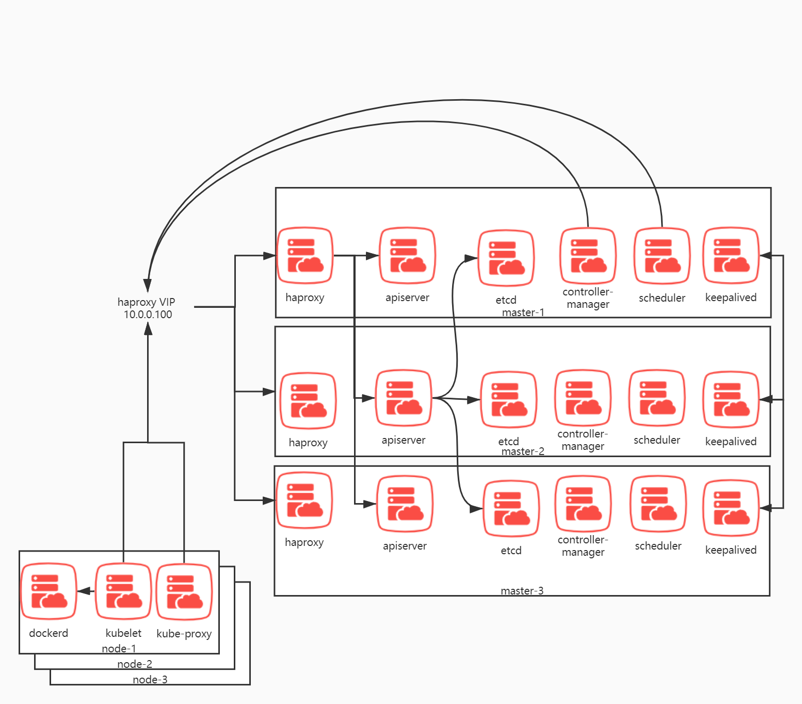

## 访问流程
### VIP
    
K8S worker节点(node-x命名的节点)上的 kubelet 和 kube-proxy 通过 VIP 去访问 kube-apiserver。

K8S master 节点上的 kube-controller-manager 和 kube-scheduler 通过 VIP 去访问 kube-apiserver 以完成选举和 informer watch 并执行各自的任务。

* 注意 VIP 功能需要开启操作系统的组播功能，因为 VIP 基于keepalived。keepavlied则基于组播来完成选主，否则将会脑裂。
* VIP 发生漂移的时候，k8s client-go 的 informer 会发生短暂异常中断并尝试重连VIP。而kube-scheduler kube-controller-manager kube-proxy kubelet 等组件都有informer的调用。VIP 它并不适合长连接应用。

### haproxy

使用 keepalived选主来将 VIP 来绑定到某个master节点上，当client-go和其他四大组件（scheduler controller-manager ）访问10.0.0.100的时候， haproxy 将会收到数据包，然后转发给某个kube-apiserver。

每一个haproxy都连接所有的 kube-apiserver 来完成负载均衡。

* 建议 haproxy 的监听地址是宿主机的0.0.0.0地址，这样方便拿VIP地址上的数据包。如果是docker运行的 haproxy 则需要--network=host

### etcd

让每一个 kube-apiserver 都连接所有的 etcd 服务器地址，这样是高可用的，因为 etcd 本身就是高冗余 raft 复制的存储，访问任意节点都能拿到完整数据。