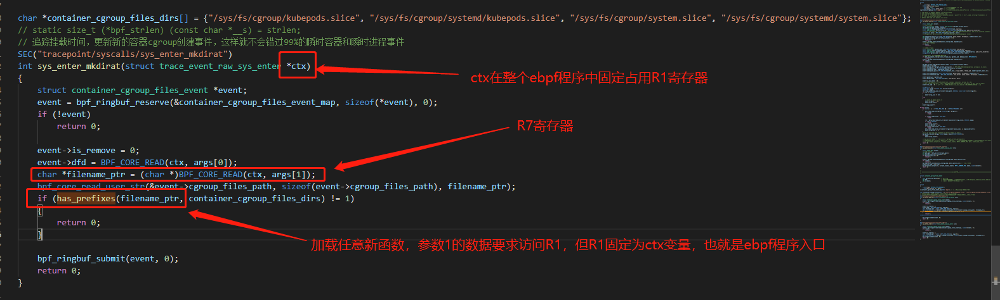
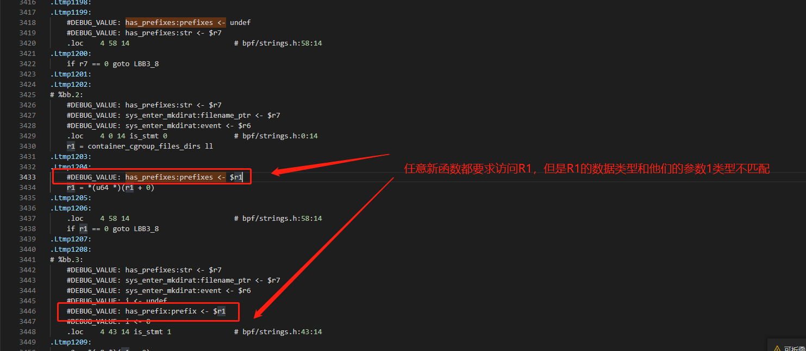
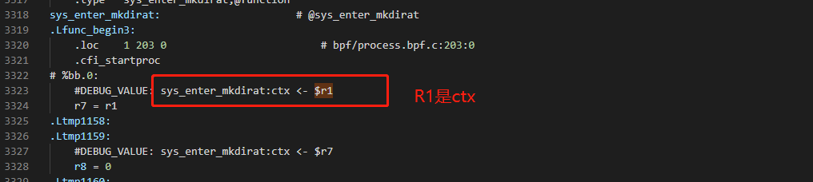
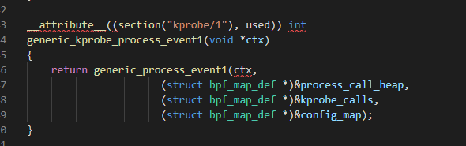
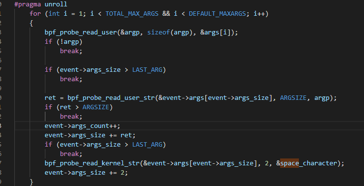
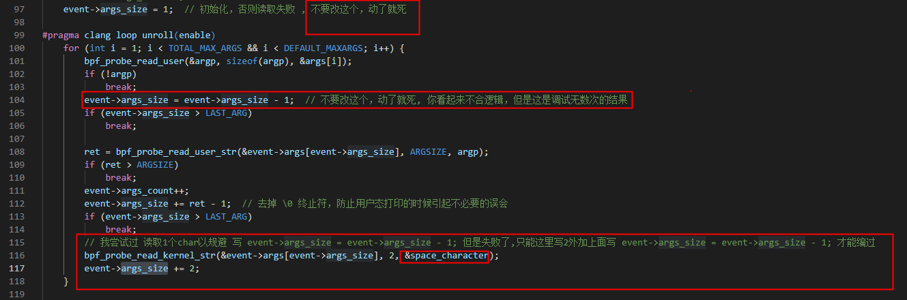
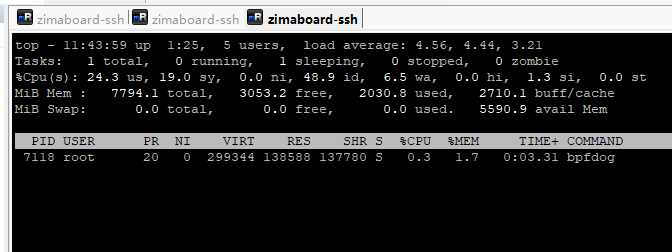
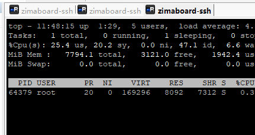

注意 大部分报错信息都是 golang的cilium/ebpf库的报错，目前libbpf可没有cilium/ebpf这么详细的报错。用libbpf写加载器容易两眼一抹黑

### 列表
1. FATA[0000] LoadAndAssign error -> field EnterMkdiratProg: program sys_enter_mkdirat: map container_cgroup_files_event_map: map create: invalid argument (without BTF k/v)

    这是ringbuf 的max_entries太小了，最低4*1024

2. argument list tooo long 

    可能是map的max_entries太大了

3. 如何复制ebpf程序定义的全局变量char* 字符串数据

    ebpf程序定义的char xxx[] 这种都属于内核数据，应当使用 bpf_probe_read_user_str 来将数据复制到要发送到用户态程序的事件结构体字段上。

3. 如何访问 内核结构体数据，比如vmlinux.h上定义的内核结构体数据

    以内核结构体 struct task_struct *task 为例，不能直接 task->nsproxy->pid_ns_for_children,这样的方式访问数据会被ebpf虚拟机认为存在空指针的可能性而不让程序加载进ebpf虚拟机。

    应当使用这种方式访问数据，如果是int类型的数据 BPF_CORE_READ(task,nsproxy,pid_ns_for_children) ，如果是字符串类型的数据 BPF_CORE_READ_USER_STR(task,nsproxy,pid_ns_for_children)

4. api 兼容性列表

    https://github.com/iovisor/bcc/blob/master/docs/kernel-versions.md

5. const 全局变量需要 5.2 内核才能支持

    最好别再ebpf程序代码中定义const全局变量 https://github.com/cilium/ebpf/discussions/592

6. c语言标准库不可使用

    导入 stdio.h stblib.h 这些都会编译报错，且这些标准库有太多可能存在 -> 这样的直接指针数据访问方式而无法通过ebpf虚拟机验证，如果有排序、查找、过滤等需要，需要自己手动编写函数。

    ebpf的c语言是标准c语言的迷你子集，常规的编程思路会容易吃瘪。

    目前遇到了，标准库strlen函数和ringbuf只能二选一，同时写strlen和ringbuf申请则会无法通过ebpf校验器，报错 symbol "strlen": unsatisfied program reference

8. 用户态和内核态ebpf程序如何动态交互过滤规则数据

    在ebpf程序中，定义一个 map ，它的类型可以是 [ BPF_MAP_TYPE_HASH, BPF_MAP_TYPE_ARRAY, BPF_MAP_TYPE_PERCPU_HASH, BPF_MAP_TYPE_PERCPU_ARRAY ]，用户态ebpf程序加载器将其ebpf程序和map加载到内核ebpf虚拟机之后，用户态通过map的fd来更新这个map的数据，这样内核态ebpf程序读取map的时候就可以读到新的数据，当然注意用户态在更新map的时候 考虑一下 加锁的flag参数。

9. FATA[0001] LoadAndAssign error -> field ExitExecveProg: program sys_exit_execve: load program: permission denied: R0_w=inv(id=0) R1_w=ctx(id=0,off=0,imm=0) R2_w=map_ptr(id=0,off=0,ks=4,vs=4,imm=0) R3_w=inv4294967295 R4_w=map_value(id=0,off=0,ks=4,vs=8040,imm=0) R5_w=inv(id=0,umax_value=4294967295,var_off=(0x0; 0xffffffff)) R6=ctx(id=0,off=0,imm=0) R7_w=map_value(id=0,off=0,ks=4,vs=8040,imm=0) R10=fp0 fp-8=mmmm????: R5 unbounded memory access, use 'var &= const' or 'if (var < const)' (44 line(s) omitted)

    这通常见于 定义了全局变量 u64 event_data_size = sizeof(event_struct); 然后再bpf程序中 bpf_perf_event_output(ctx, &create_process_events, BPF_F_CURRENT_CPU, data, event_data_size);

    修改为 bpf_perf_event_output(ctx, &create_process_events, BPF_F_CURRENT_CPU, data, sizeof(*data));

10. load program: permission denied: 14: (71) r4 = *(u8 *)(r1 +0): R1 invalid mem access 'inv' (30 line(s) omitted) 
    这通常是因为 最后一行的return 值和 for循环里面的return 值不一致导致的，比如for里面return 1 函数最后一行return 0 就会出现这个错误。 R1寄存器存储的是第二个函数参数

    实际上，ebpf对for循环的支持非常不友好，参阅 https://yanhang.me/post/2021-ebpf-loop/

    想要在ebpf中使用for循环遍历某个char ** 这种2D数组，就必须 #define 固定长的宏名字 固定一个数字512 ; for(int i =0;i <= 固定长度的宏名字;i++) {}

    比如
    ```c
    #define MAX_STEP_LOOP_CHAR 512
    /*
    * has_prefix 检查字符串是否含有某段字符串前缀
    */
    static __always_inline int has_prefix(char *str, char *prefix)
    {
        if (!str || !prefix)
        {
            return 0;
        }

    #pragma clang loop unroll(full)
        for (int i = 0; i <= MAX_STEP_LOOP_CHAR; i++)
        {
            if (!prefix[i])
            {
                return 1;
            }
            if (str[i] == '\0' || str[i] != prefix[i])
            {
                break;
            }
        }

        return 0;
    }
    ```

11. invalid argument: Unreleased reference id=2 alloc_insn=14 (130 line(s) omitted) 

    这通常来自于 自定义global function 引用了被推送给用户态的地址数据。比如struct event 将被推送到ringbuf中，但是自定义函数引用了event的成员字段。

12. R1 invalid mem access inv. R1 寄存器非法访问

    ebpf寄存器介绍 https://www.kernel.org/doc/html/v5.17/bpf/instruction-set.html

    让clang导出汇编来分析内容 clang -O2 -g -Wall -Werror -target bpf -c bpf/process.bpf.c -S -o process.asm.s
    
    
    

    参考tetragon的做法，将R1寄存器的ctx传递下去
    

    修正方法


13. load program: invalid argument: Arg#0 type PTR in match_cgroup_dirs() is not supported yet. (2 line(s) omitted) 

14. libbpf 官方并没有 c++  例子(截止日期 20230311 只有bpftool gen skeleton out/process.o > bpf/skels/process.skel.h 这样的来生成c++文件)，目前属于是强行在使用c++调用libbpf，略微有一些兼容问题，通过手动修改源码解决的。

    一个c++ enum forward declaration 错误解决例子 https://github.com/libbpf/libbpf/issues/249#issuecomment-1435261946

15. libbpf 目前未能成功在centos 5.4上成功通过编译，更倾向于考虑将ebpf加载器做成独立成功和agent通信（上报数据），不支持ebpf的环境下agent就不去运行ebpf加载器程序。

16. 目前ebpf程序内核态能够遍历 char ** 字符串数组数据，但不能遍历char * 字符数组数据，这涉及到了char *数据是否会进入map，如果char *指向的数据进入了map则任何对char *数据的操作都将导致R1寄存器错误，如果不进map则可以遍历char *数据。目前可以操作int类型的数据做比较，对于ip的比较，则ebpf存在专用的IP范围段比较函数，ebpf程序栈空间最大512字节，超过的数据则通过 ebpf map来完成暂存和在单个程序内或多个ebpf程序内读取

17. ebpf程序的自定义函数只能是static inline 的，否则校验器不通过，static 函数似乎和ebpf程序主函数共享R1寄存器数据，也就是tracepoint程序函数的第一个参数void *ctx，ctx必须被不停作为第一个参数传递给每一个自定义函数，否则容易出现寄存器错误

18. clang __builtin_memcmp 无效问题，试图这个用来做字符串前缀比较

    目前无解 https://github.com/cilium/pwru/issues/32#issuecomment-1441560969

19. 关于 char ** 这种char * 数组还有'\0'终止符的故事，以及C++不兼容vmlinux.h的事情
    故事的起源是我将基于golang库cilium/ebpf的的进程启动事件抓取代码 改写 为libpf C++代码的故事

    来看一段代码处理进程启动参数
    ```c
    const char **args = (const char **)(ctx->args[1]);
    const char *argp;
    char space_character[2] = " "; // 包含一个空格和一个'\0'终止符，所以长度为2
    ```
    先看golang版本的内核态ebpf程序处理代码
    
    再看c++版本的内核态ebpf程序处理代码
    

    event->args 这个 char[7680]; 里面包含了 '\0' 导致了C++打印函数遇到\0就终止后续几千个char的打印了，而go语言似乎无视了 \0 才导致我在用go语言实现的时候啥事没有。

    在bcc基于libbpf改造的工具中 https://github.com/iovisor/bcc/blob/master/libbpf-tools/execsnoop.c ，在static void print_args(const struct event *e, bool quote)函数中，他们手动在用户态处理了'\0', 我之所以会写成这样，主要还是因为我想在内核态拼装好这些 args

    也可能是golang并没有无视\0 ，golang获取数据的时候走的是 字节流，而c语言获取数据走的是指针。这个问题比较魔幻

    最终输出效果就是
    ```json
    {
        "exec_path":"/usr/bin/sed",
        "args":"-n s/^cpu\\s//p /proc/stat ",
    }
    ```

    最后注意，如果event结构体要复用在用户态（c++）和内核态，那么绝对不可以让时间结构体使用 u64 u32 这种vmlinux.h（bpftool生成的）里面才有的东西（c++ vmlinux.h编译不过）。golang没有这个限制。

20. 关于libbpf perf_buffer__new 函数引发的 shared（共享）内存过高问题。
    函数形式
    ```c
    perf_buffer *perf_buffer__new(int map_fd, size_t page_cnt, perf_buffer_sample_fn sample_cb, perf_buffer_lost_fn lost_cb, void *ctx, const perf_buffer_opts *opts)
    ```
    我的ebpf事件结构体长度为8040
    ```c
    #define ARGSIZE 128
    #define TASK_COMM_LEN 16
    #define TOTAL_MAX_ARGS 60
    #define DEFAULT_MAXARGS 20
    #define FULL_MAX_ARGS_ARR (TOTAL_MAX_ARGS * ARGSIZE)
    #define LAST_ARG (FULL_MAX_ARGS_ARR - ARGSIZE)

    // 经过测试存在这种情况，就是任务信息掉了，用户态程序要注意判断 PID=0 PPID=0 USER_ID=0 CGROUP_ID=0 CONTAINER_ID= CONTAINER_TYPE= RET_CODE=0 PROCESS_NAME= EXEC_PATH= ARGV_PAIR=
    struct process_execve_event_data {
        unsigned long user_id;              // 启动这个进程的用户ID（基于进程所在空间，如果是容器内的root，同样会显示会0）
        unsigned long cgroup_id;            // 进程的cgroup id，对于主机进程来说就是固定为1，其他容器就是非1的值
        unsigned long namespace_id;         // 命名空间ID
        unsigned long namespaced_pid;       // 进程在自身pid空间的id，通常是ps命令看到的pid
        unsigned long namespaced_ppid;      // 进程的所在空间的父进程ID，通常是ps命令看到的ppid
        unsigned long init_namespace_pid;   // init空间的进程ID，也就是ssh到主机后通过 ps 命令看到的那个pid
        unsigned long init_namespace_ppid;  // init空间的父进程ID，也就是ssh到主机后通过 ps 命令看到的那个ppid
        unsigned long global_pid;           // 进程在主机层面的空间的全局唯一进程id
        unsigned long global_ppid;          // 进程在主机层面的空间的父进程全局唯一进程id
        int ret_code;                       // 进程的执行退出码，这不是进程退出的意思，更不是进程终止的意思，这就是进程是否成功运行起来的意思，0代表成功，其他值则代表失败,这个值通常在sys_exit_execve钩子里面修正
        unsigned int is_exit_event;         // 是否是进程退出事件 0 不是 1是，用于调试
        unsigned int args_size;             // 进程的启动参数一共有多少个字符
        unsigned int args_count;            // 进程的启动参数一共有多少个
        char process_name[16];              // 进程名
        char exec_path[256];                // 进程的二进制文件在磁盘上的路径
        char args[FULL_MAX_ARGS_ARR];       // 进程启动参数
    };
    ```
    当我把perf_buffer__new的第二个参数也就是PAGE_SIZE设置为 8192时，程序最终共享内存定格在如图，且进程启动事件仍然在抓取和输出。
    
    当我把perf_buffer__new的第二个参数也就是PAGE_SIZE设置为 64时，程序最终共享内存定格在如图，且进程启动事件仍然在抓取和输出。
    

    但根据我在golang 的 cilium/ebpf库上的感受来说，PAGE_SIZE低了容易丢事件。这个PAGE_SIZE的大小取舍值的考量。