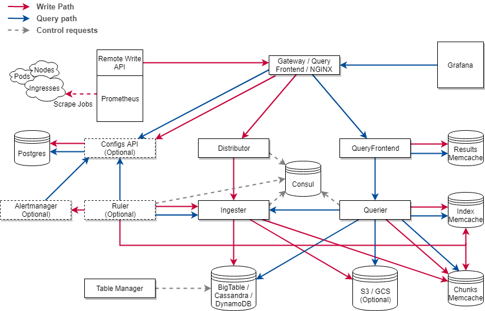

> ## 是个什么功能的软件
* 是一个兼容Prometheus restful api，提供remote read和remote writer功能，用于存储多个Prometheus数据的汇聚并接收指标查询请求输出结果。
* 支持多Prometheus发送相同label数据的去重以减少数据量。
    * 基于Prometheus的external labels和cortex内置的distributor组件的ha tracker功能
* 支持节点动态扩容和自动数据迁移以实现存储平衡
    * 当一个节点加入后，重新分配一致性哈希的令牌环token到每个节点。
* 支持一个metric指标多副本存储(复制因子(replication factor)与一致性哈希分散存储到各个节点)
* 长期存储支持Amazon DynamoDB, Google Bigtable, Cassandra, S3, GCS and Microsoft Azure
    * 数据索引存储后端
        * boltdb (本机磁盘)
        * google bigtable
        * amazon dynamodb
        * apache cassandra
    * 数据内容存储后端
        * filesystem (本机磁盘)
        * amazon dynamodb
        * google bigtable
        * apache cassandra
        * amazon s3
        * google cloud storage
        * microsoft azur storage
    * 数据内容存储方法
        * chunks (cortex自研的默认存储方法)
        * blocks (基于Prometheus tsdb)
* 支持多租户
    * 基于http header的字段X-Scope-OrgID，这个字段对于cortex来说是用来隔离数据的，一旦多租户功能开启，会引发一个问题就是，管理员想看所有租户的数据，需要做多次查询并聚合，这样会超级慢。
    * 如果要做自定义的租户认证方式，还需要自行写一个http服务来接收Prometheus remote write metrics，并判断租户的合法性，最后将metric数据交给Prometheus
    * 默认的租户名称叫fake
* 支持查询结果数据缓存
    * chunks存储方法支持每个chunk默认缓存12小时内的数据，对于blocks存储方法支持每个block缓存2小时内的数据
    * 缓存方法有 memcached，redis，自身内存（in-memory）
    * <span style="color:red">小心，metric被Prometheus送到cortex的时候，不会直接被写入后端存储，而是在缓存中先留驻</span>
        * #### 是否会爆缓存？
            下面的ingester组件的机制会讲到
> ## 架构(以下均为内部组件，实际上是一个单体应用)

* ### distributor
    * #### 描述
        无状态服务，最前端的接收Prometheus remote write,主要是验证数据格式合法性，是否超出当前租户的容量限制，然后将数据切割为多份然后并行地发给不同的ingester。

        多实例的时候推荐使用round robin方式来负载均衡。
    * #### 对metric的验证：
        * metric的label和名称格式的合法性
        * 是否超过服务器配置的每个metric最多label数
        * 是否超过服务器配置的每个metric name最大长度
        * 时间戳不超过服务配置的最老和最新的范围
    * #### 高可用的tacker数据去重
        distributor 提供了一个特性叫高可用的tracker服务 High Availability(HA) Tracker.当开启这个服务之后，distributor会丢弃多个相同job的Prometheus发来的冗余数据，比如3个相同Prometheus实例job相同，则取其中一个的数据其余两个的数据丢弃。这使得配置Prometheus高可用时数据不会变的冗余。

        HA Tracker去重基于Prometheus metric中的label "cluster" 和 "replica"。cluster label表示这个数据属于哪个Prometheus集群。replica label表示这个metric来自哪个Prometheus实例。当收到metric数据后会丢弃不是leader replica的数据，判定条件时replica label。

        HA Tracker 依赖kv存储(如etcd，consul)来选举leader replica，如果一个metric 没有cluster label 或者 没有replica label 将会全部归纳到default租户名下。
    * #### 哈希
        distributor使用了一致性哈希，通过一个叫replication factor的配置来确认metric数据会落点到哪个ingester实例上。

        cortex支持两种哈希策略：
        * 基于metric name和租户id的哈希(默认方式)
        * 基于metric name label 和 租户id的哈希（通过-distributor.shared-by-all-labels=true 来启用）
    * #### 哈希环
        哈希环（放在kv存储系统中）用于实现以实现哈希对metric数据落点计算和副本数据查询横跨所有ingesters。所有的ingesters注册他们自身的tokens到哈希环中，这样经过计算得到token就很快确定落点在哪个ingester了，这些token都是随机的int32。每个进来的metric数据都会在distributor做哈希计算token落点，然后推送到持有这个token range的ingester实例。

        做哈希落点计算的时候distributor查找比当前metric哈希token大的第一个最小token。当replication factor配置大于1的时候，下一个顺时针的token所在的ingester也将保存这份metric数据。

        hash token range的好处就是假如这里有三个数 0 25 50,如果当前ingester实例的token是25，那么ingester的token存储范围将是1-25。每一个metric 哈希之后会得到一个数字决定去哪个hash range的ingester。

        哈希环tokens 通常存储在etcd consul中。
    * #### Quorum一致性
        当所有的distributors都使用同个哈希环的时候，将写入请求发送到任何distributor都是可以的，可以建一个K8S service给distributor或者架一个nginx在distributors前面。

        使用dynamo-style的quorum一致性协议，这意味着distributor将等待半数以上的数据落点ingesters的确切的写入回复之后才会恢复Prometheus的remote write 成功写入了。
* ### ingester
    * #### 描述
        负责将distributor传递过来的metric数据写入长期存储，也负责为querier服务从in-memory缓存中搜索metric数据。
        
        在接收到distributor的数据时，并不会立即写入长期存储，而是保存在in-memory中，周期性地写入到长期存储中（默认chunk存储12小时，block存储2小时），因此querier既从ingester获取数据也要从长期存储中获取数据。

        ingester内置一个叫lifecycle的管理器来存储ingester的状态到哈希环中，每个ingester都有如下状态

        * #### PENDING 
            ingester处于刚启动状态，在这个状态下，ingester不会接收任何的写入和读取请求，并且可能等待其他处于leaving状态的ingester传入metric数据（如果其他ingester开启了hand-over功能并使用chunks存储）
            * #### hand-over
                当cortex使用了chunks存储并禁用WAL，cortex将支持把一个处于LEAVING状态的ingester数据交给N个处于JOINING状态的ingester
        * #### JOINING
            ingester开始加入哈希环，在这个状态下ingester不会接收任何写入和读取的请求，ingester将加入哈希环并分配获取tokens，除非能使用本地tokens文件（通过启动参数-ingester.token-file-path配置）或生成一堆新的随机tokens。最后开始解决tokens冲突，一旦tokens冲突解决，就进入ACTIVE状态
        * #### ACTIVE
            ingester 在这个状态下将开始接收读取和写入的请求
        * #### LEAVING
            ingester 正处于关闭中并且会脱离哈希环，在这个状态下不接受写入请求，但可以接收读取请求
        * #### UNHEALTHY
            ingester无法和存储哈希环的kv存储系统保持心跳，处于这个状态下，distributor在选择metric副本落点时跳过这个ingester，并且这个ingester不在接收写入和读取请求。
    * #### 存储方法
        * chunks（默认）
            将每一个单条时间序列存入一个叫做块（chunk）的对象当中。每一个块中包含
        * blocks（基于Prometheus的tsdb技术）
            这里的块指的是基于Prometheus TSDB产生的小块文件，熟悉Prometheus的都知道Prometheus存储体现在磁盘上就是分块的文件。每一个租户的数据都存储在各自的tsdb文件中。
    * #### 丢数据的情况
        如果一个ingester实例突然崩溃或者退出了，所有的in-memory方法缓存的还没有写入长期存储的时序数据将会丢失，有如下两种方法来减少损失:
        * #### 多数据副本
            多数据副本（通常是3）在ingesters集群中，如果cortex集群失去了一个ingester实例时，in-memory级别的缓存数据是会丢失的，但数据的副本早已在其他的ingester上存储了。不会产生单点故障，多副本也完成了故障转移。

            如果是多节点同时挂掉将有潜在的丢失数据的风险。

        * #### 写wal文件 write-ahead-log
            wal文件日志用于异常恢复，主要是将所有未写如长期存储的metric数据保存起来。当发生ingester崩溃事件后的重启过程中将会重放WAL文件日志用于恢复in-memory级别的metric数据。

            WAL文件日志默认对于chunks存储方法是不启用的，他通常对于block存储方法启用。
    * #### ingesters 写入防扩张（防止in-memory爆炸）
        ingester在in-memory存储近期收到的metric数据的目的是为了提高写入性能。如果ingester直接将收到的数据写入长期存储，那么长期存储系统的数据量将变得十分膨胀且难以压缩，因此ingester批量压缩in-memory的数据然后周期性地将他们写入长期存储。

        调低in-memory的保留时间也是个不错的选择.
* ### querier
    * #### 描述
        http无状态服务，最前端的接收Prometheus remote read，兼容promQL。

        querier同时从ingester的in-memory和长期存储获取metric数据，由于一个metric存在多副本来保证容灾，因此查询储来的数据可能是有重复数据的。为了解决这个问题，通过丢弃相同时间戳且metric名称相同的数据来进行去重。
* ### query frontend(可选组件，非必要)
    * #### 描述
        http无状态服务，一旦启用这个功能将使得query-frontend 成为一个查询请求队列管理器，query成为一个任务执行器从query-frontend 拉取查询任务来执行。
        
        需要在query上启用参数-querier.frontend-address才能激活这个功能，而且激活之后需要将Prometheus remote read的地址改为query frontend的地址。

        虽然是无状态服务，大多数情况下部署2个实例就够了.
    * #### 查询任务队列化
        用于下列情况
        * 明确查询可能会导致OOM错误在querier组件
        * 需要阻挡大量请求，过来的请求会放入FIFO队列
        * 阻挡单个租户发动的DOS攻击导致其他租户无法正常使用
    * #### 查询加速(切割任务)
        在查询的时候会将一个查询五天的数据按天分为五个一天的查询任务，并发地执行这五个查询。
    * #### 查询缓存
        支持查询结果缓存（memcached，redis，自身内存缓存），如果缓存内的查询结果不完整，那么query frontend 会计算需要的子查询并且并发地执行他们在 downstream queries。
        
* ### query scheduler(可选组件，非必要)
    * #### 描述
        是一个将query-frontend的队列移动到自身，这使得queery fronted 可变的自由伸缩数量和存放任意数量的查询请求任务到队列。

        要使用query scheduler,需要给query frontend加上启动参数-frontend.scheduler-address,给querier组件加上-querier.scheduler-address

* ### table manager(内部库，非组件)
    * #### 描述
        非可运行的独立服务，而是一个库用于适配bigtable,cassandra,dynamodb
* ### ruler(可选组件，非必要)
    ruler是一个执行promQL查询来兼容Prometheus recording rule 和 alert rule的组件，本组件需要一个数据库来存储每个租户的recoding rule和alert rule。

    支持多租户。

    ruler是一个半有状体服务，并且可以水平伸缩。内部维护rules的状态。如果ruler所有实例都崩溃或重启，Prometheus alert 将从active返回firing状态，。有一定的recoding rule刷新缝隙间隔。
* ### alertmanager(可选组件，非必要)
    实际上是嵌入了一个alertmanager官方版本并添加了多租户支持，接收来自ruler组件的告警通知，并分组去重告警，然后通过alertmanager的通知方式去发送这些告警。

    是半有状态的服务，告警数据存储在自身磁盘当中，如果所有的alertmanager都崩溃了，数据将会丢失。
* ### configs api(可选组件，非必要):
    提供了http restful api来管理Ruler服务和Alermanager服务，支持 get/set/update 来操作alertmanager和ruler的配置，并把配置数据存入后端，当前支持的存储后端有postrgreSQL和in-memory
> ## 多Prometheus实例采集数据的去重和坑
* ### 描述
    所谓的去重，其实际上是用一个参数--ha.distribution, 基于Prometheus发过来的序列中的两个label，即cluster和__replica__。需要etcd或consul来进行选举，这个选举操作由cortex来完成。
    
    假设有两个团队T1 T2，他们分别运行各自的Prometheus监控相同的target，并且都开了两个Prometheus，分别为T1.a T1.b T2.a T2.b ,此时如果不加上去重则会T1.a T1.a会发送相同的数据给cortex。如果加上了去重参数，则只会收到T1.a或T1.b的数据，T2团队的数据同理。如果长时间（默认30秒）没有收到来自T1.a的数据则会接受T1.b的数据,同时设置T1.b为leader，这段时间的真空期需要能接受如果启用了去重。
    
    cortex的Distributor组件只接受被选举的replica的数据，其余的丢弃。实际上cortex本身含有多副本存储，所以如果确实要保证Prometheus高可用而运行了多个Prometheus还是要加上这个去重的label。
* ### 如何配置ha去重
    在prometheus的配置中设置cluster和__replica__两个external label
    ```yaml
    cluster: T1
    __replica__: T1.a # 或T1.b
    ```
    在cortex服务器上配置启动参数 [文档](https://cortexmetrics.io/docs/configuration/configuration-file/#etcd_config)
    * -distributor.ha-tracker.enable=true
    * -distributor.ha-tracker.kvstore.store=etcd
    * -distributor.ha-tracker.kvstore.etcd.endpoints=http://127.0.0.1:2379
    * -distributor.ha-tracker.enable-for-all-users 可选，如果开了多租户，并且他们都设置好了那两个label

* ### 一个指标多副本存储
    * 命令行参数
        * -distributor.replication-factor=3 用于读写数据的ingester实例数量
        * 配置文件中 ingester.lifecycler.kvstore.ring.replication_factor=3 一致性哈希计算三份副本分散存储
* ### 节点数据存储的自动平衡
    * 使用一致性哈希外加多副本机制来保证
    * 丢数据的情况
        * 原因
            ingester对于chunks存储默认会给每个chunk的数据在内存中停留12小时，对block storage则对每个block的数据在内存中停留2小时。此时ingester的 replication-factor设置为3，表示存储三分在不同节点上。如果当前的ingester挂掉，那么其他节点上还有数据保证可用。如果存储的节点都挂了，并且数据没有被写入到长期存储，那就丢失数据。
