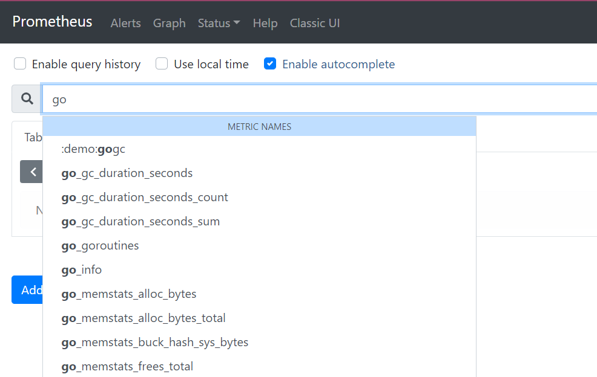
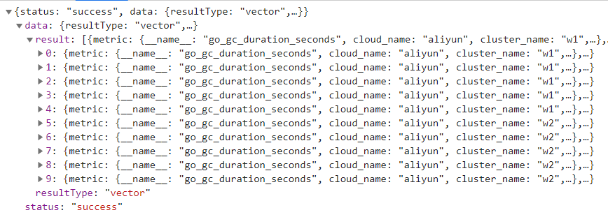
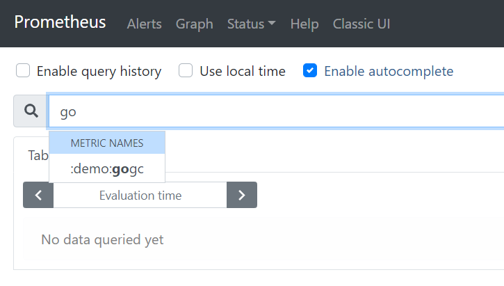
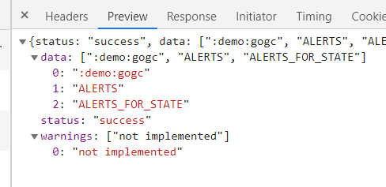

> ## 自动补全metric列表的坑(v2.24.1版本为例)
* ### 描述
    通常在webui上会有一个输入框 当我们输入字符"go"的时候会出现一个列表。如图

    

    是因为Prometheus的webui在加载主页的时候调用了api  <pre>/api/v1/label/__name__/values</pre>
    

    但remote writer 并没有实现这个api导致了 <pre>/api/v1/label/__name__/values</pre> 返回了如下结果,没有任何自动完成
        
        
    
    

    参见代码

        https://github.com/prometheus/prometheus/blob/release-2.24/storage/remote/read.go#L209

        https://github.com/prometheus/prometheus/blob/release-2.24/storage/remote/read.go#L215

* ### 解决办法(改代码)
    下载Prometheus 2.24.1的源码

    代码出处https://github.com/prometheus/prometheus/pull/7076/files

    请务必使用vscode等自动import package的IDE，以避免不必要的麻烦

    新增文件 /storage/remote/client_name_label_values_patch.go
    ```golang
    // Copyright 2016 The Prometheus Authors
    // Licensed under the Apache License, Version 2.0 (the "License");
    // you may not use this file except in compliance with the License.
    // You may obtain a copy of the License at
    //
    // http://www.apache.org/licenses/LICENSE-2.0
    //
    // Unless required by applicable law or agreed to in writing, software
    // distributed under the License is distributed on an "AS IS" BASIS,
    // WITHOUT WARRANTIES OR CONDITIONS OF ANY KIND, either express or implied.
    // See the License for the specific language governing permissions and
    // limitations under the License.

    package remote

    import (
        "context"
        "encoding/json"
        "fmt"
        "io"
        "io/ioutil"
        "net/http"
        "regexp"
        "strings"

        "github.com/pkg/errors"
        "github.com/prometheus/prometheus/storage"
    )

    type labelsResponse struct {
        Data     []string `json:"data,omitempty"`
        Error    string   `json:"error,omitempty"`
        Warnings []string `json:"warnings,omitempty"`
    }

    // makeLabelsRequest makes the actual request for /label and /labels/{name}/values from the remote client
    func (c *Client) makeLabelsRequest(ctx context.Context, url string) ([]string, storage.Warnings, error) {
        httpReq, err := http.NewRequest("GET", url, nil)
        if err != nil {
            return nil, nil, errors.Wrap(err, "unable to create request")
        }

        httpReq.Header.Set("User-Agent", UserAgent)

        ctx, cancel := context.WithTimeout(ctx, c.timeout)
        defer cancel()

        httpResp, err := c.Client.Do(httpReq.WithContext(ctx))
        if err != nil {
            return nil, nil, errors.Wrap(err, "error sending request")
        }
        defer func() {
            io.Copy(ioutil.Discard, httpResp.Body)
            httpResp.Body.Close()
        }()

        body, err := ioutil.ReadAll(httpResp.Body)
        if err != nil {
            return nil, nil, errors.Wrap(err, fmt.Sprintf("error reading response. HTTP status code: %s", httpResp.Status))
        }

        if httpResp.StatusCode/100 != 2 {
            return nil, nil, errors.Errorf("remote server %s returned HTTP status %s: %s", url, httpResp.Status, strings.TrimSpace(string(body)))
        }

        var resp labelsResponse
        err = json.Unmarshal(body, &resp)
        if err != nil {
            return nil, nil, errors.Wrap(err, "unable to unmarshal response body")
        }

        if resp.Error != "" {
            return nil, nil, errors.New(resp.Error)
        }

        var warnings storage.Warnings
        for _, warning := range resp.Warnings {
            warnings = append(warnings, errors.New(warning))
        }

        return resp.Data, warnings, nil
    }

    // LabelValues queries label values from a remote endpoint.
    func (c *Client) LabelValues(ctx context.Context, name string) ([]string, storage.Warnings, error) {
        re := regexp.MustCompile(`read/?$`)
        url := re.ReplaceAllString(c.url.String(), "label/"+name+"/values")
        return c.makeLabelsRequest(ctx, url)
    }

    // LabelNames queries label names from a remote endpoint.
    func (c *Client) LabelNames(ctx context.Context) ([]string, storage.Warnings, error) {
        re := regexp.MustCompile(`read/?$`)
        url := re.ReplaceAllString(c.url.String(), "labels")
        return c.makeLabelsRequest(ctx, url)
    }

    ```
    
    覆写/storage/remote/read.go的两个函数成如下所示,然后删除/storage/remote/read_est.go 以免报错（其实是我不想改test文件了） 
    ```golang
    // LabelValues implements storage.Querier and is a noop.
    func (q *querier) LabelValues(name string) ([]string, storage.Warnings, error) {
        // TODO: Implement: https://github.com/prometheus/prometheus/issues/3351
        res, warnings, err := q.client.LabelValues(q.ctx, name)
        if err != nil {
            return nil, warnings, fmt.Errorf("remote_read: %v", err)
        }
        return res, warnings, nil
    }

    // LabelNames implements storage.Querier and is a noop.
    func (q *querier) LabelNames() ([]string, storage.Warnings, error) {
        // TODO: Implement: https://github.com/prometheus/prometheus/issues/3351
        res, warnings, err := q.client.LabelNames(q.ctx)
        if err != nil {
            return nil, warnings, fmt.Errorf("remote_read: %v", err)
        }
        return res, warnings, nil
    }
    ```

    追加两个函数定义到接口上 /storage/remote/client.go
    ```golang
    type ReadClient interface {
        Read(ctx context.Context, query *prompb.Query) (*prompb.QueryResult, error) // 这是官网自带的
        LabelNames(ctx context.Context) ([]string, storage.Warnings, error) // 这行是新增的
        LabelValues(ctx context.Context, name string) ([]string, storage.Warnings, error) // 这行是新增的
    }
    ```

* ### 开始编译
    由于Prometheus是把webui嵌入到exe文件中的，因此不要去直接执行go build。

    为了省事直接用源码根目录的makefile。

    由于ui是react js写的，还需要安装yarn

        npm install -g --registry=https://registry.npm.taobao.org yarn
        或
        cnpm install -g yarn
        
        千万不要 apt install yarn 这是个不同的东西

        安装之后在这里 /usr/local/lib/node_modules/yarn/bin/yarn
        执行ln -s /usr/local/lib/node_modules/yarn/bin/yarn /bin/yarn
        设置国内镜像 yarn config set registry https://registry.npm.taobao.org/

    下载 golangci-lint v1.36.0 并放入$PATH https://github.com/golangci/golangci-lint/releases
    
    如果是wsl 还需要 export GOOS=windows 来获得Windows平台的exe文件

    执行 make build得到 可执行文件 prometheus.exe， 不行就直接执行make
        
        如果遇到错误
        Please ensure you are using go version go1.15.7 linux/amd64 for formatting code.
        make: *** [Makefile.common:126: common-style] Error 1

        就需要注意文件本身的CRLF 全转换LF即可


        license header checking failed:
        ./storage/remote/client_name_label_values_patch.go
        make: *** [Makefile.common:136: common-check_license] Error 1
        表示没有在文件第一行加上协议注释

        注意官方推荐的方式是gopath编译
      
