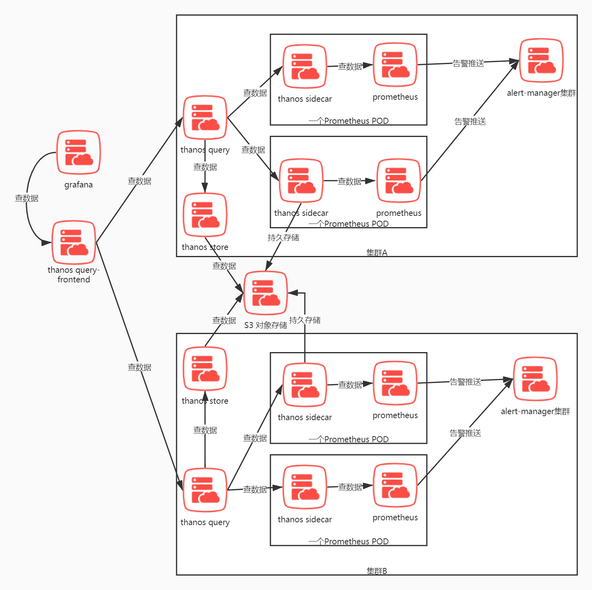
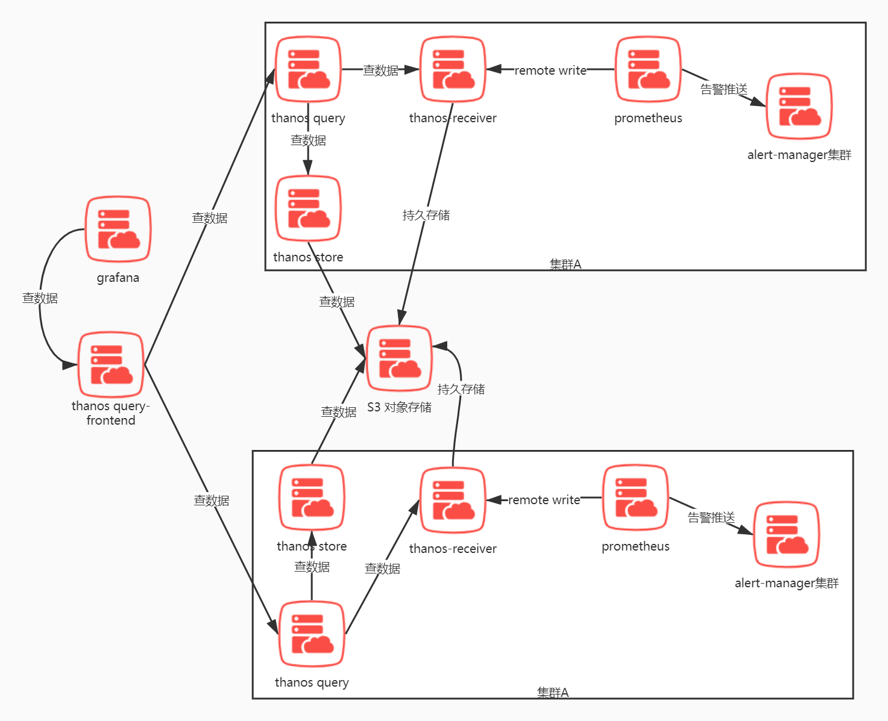
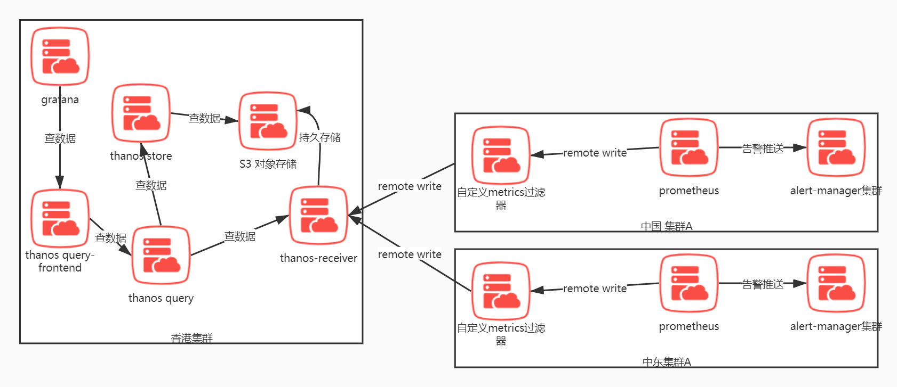

### 总体预览
### sidecar 模式单集群


### receiver 单云多集群模式


### receiver 多云多集群模式


### 描述
    将grafana和S3对象存储 以及thanos query frontend 部署在任意的可连接的K8S集群，且thanos sidecar必须要能连接上S3服务。

    thanos query frontend 和 grafana要在一起。

    Prometheus 需要配置external labels 来表示自己属于哪个集群，这样方便grafana面板过滤和告警内容表示来自哪个集群。

    注意 thanos的 sidecar、store、receiver 都是实现了store api的。
    
    他们可以被thanos query直接调用，而无法被thanos query-frontend直接调用，thanos query-frontend 是只能调用thanos query的组件。

## 组件描述
### thanos sidecar
    和Prometheus 在一个pod里面的容器。负责找Prometheus查先有数据和从S3持久存储中查历史数据。
    
    兼容prometheus api，承接query frontend或grafana的查询。

* #### sidecar 何时上传tsdb的block到S3对象存储
    当Prometheus压缩一个tsdb block到本地后 则触发上传，上传过的列表会被记录到prometheus data 目录下的thanos.shipper.json文件中,上传失败的会被重试上传。因此Prometheus本身的高可用也决定了数据是否会断层，为了解决这个问题，需要使用thanos receiver模块。

    且thanos receiver模块同时也能解决Prometheus wal文件损坏导致数据丢失的问题。

### thanos query frontend
* 兼容prometheus api，承接来自grafana的查询。对于如5天时间范围的任务或被分割为五个1天的小查询任务，控制分割间隔的参数为--query-range.split-interval，默认值为24小时。
* #### 查询失败的重试
    如果一个查询失败了会尝试重试，控制重试次数的参数是--query-range.max-retries-per-request
* #### 查询结果的缓存。
    会缓存查询结果并复用到下一个查询请求，如果下一个查询请求不兼容即多出来一天的时间返回，则会自动分析出需要执行的查询，即只查询多出来的那天。这些查询都是并行执行的，执行者是下游的thanos sidecar。

    注意截至版本0.18.0, thanos query-frontend 仅仅支持/api/v1/query_range的查询分割和查询缓存。其余api都是直接转发给下游的thanos query
    * 缓存类型
        * In-Memory
        ```yaml
        type: IN-MEMORY
        config:
          max_size: "" # 这里可以是1KB 1MB 1GB
          max_size_items: 0
          validity: 0s # 缓存有效时间，0表示永久
        ```
        如果max_size 和 max_size_items没有被设置，将不会创建缓存。如果只是设置两项中的其中一项，则另一项是无限制的(unlimited)。
        * Memecached
        ```yaml
        type: MEMCACHED
        config:
          addresses: []
          timeout: 0s
          max_idle_connections: 0
          max_async_concurrency: 0
          max_async_buffer_size: 0
          max_get_multi_concurrency: 0
          max_item_size: 0
          max_get_multi_batch_size: 0
          dns_provider_update_interval: 0s
          expiration: 0s
        ```
* #### 慢查询日志
    当查询的时间超过该数值的时候将会被记录到慢查询日志。
    
    控制参数--query-frontend.log-queries-longer-than,如--query-frontend.log-queries-longer-than=10s。
    
    设置为0表示禁用，设置小于0表示对所有查询都开启记录。