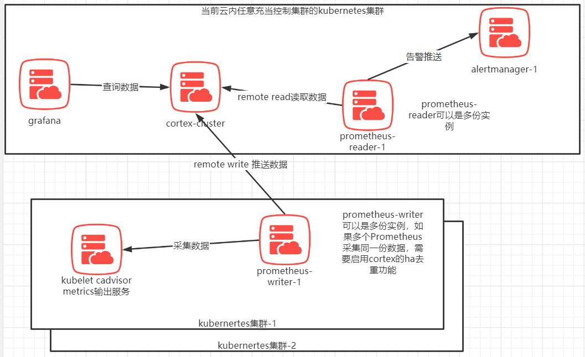
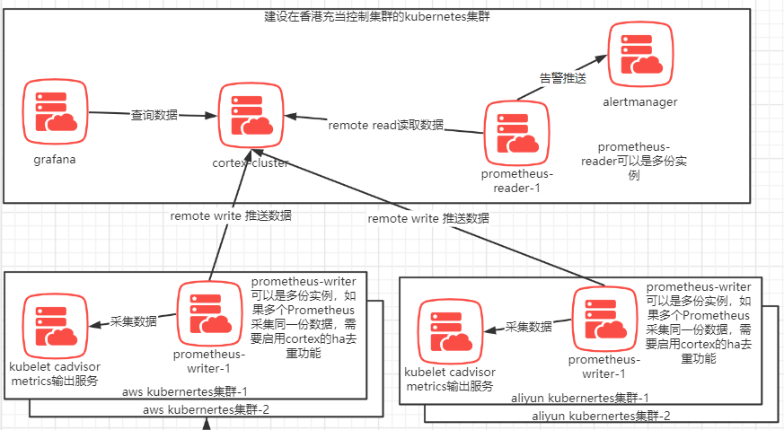
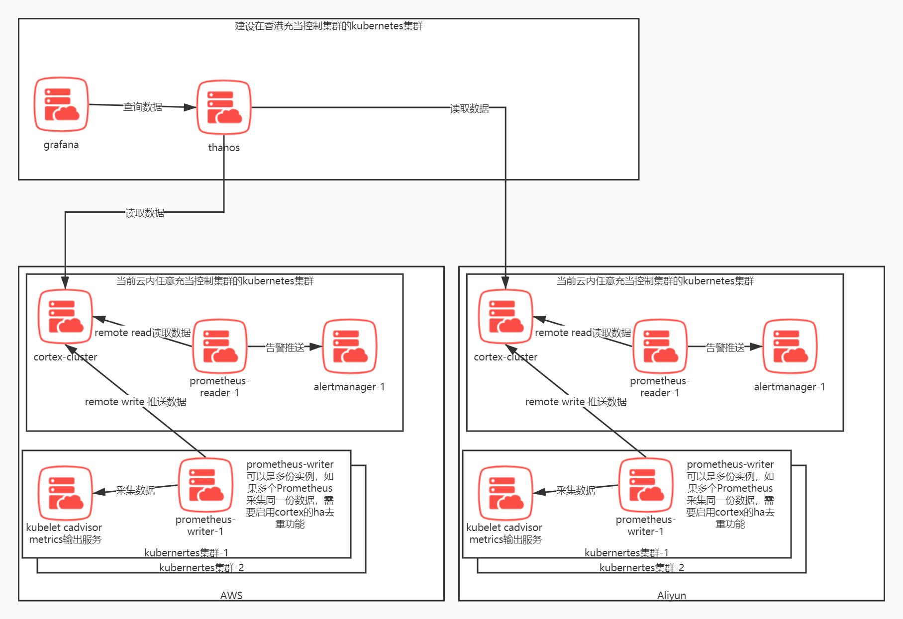
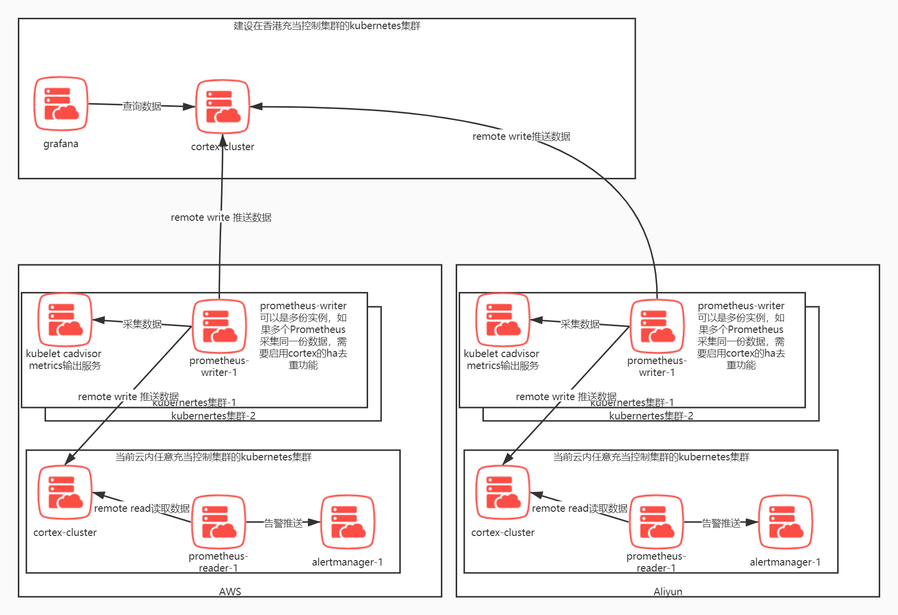
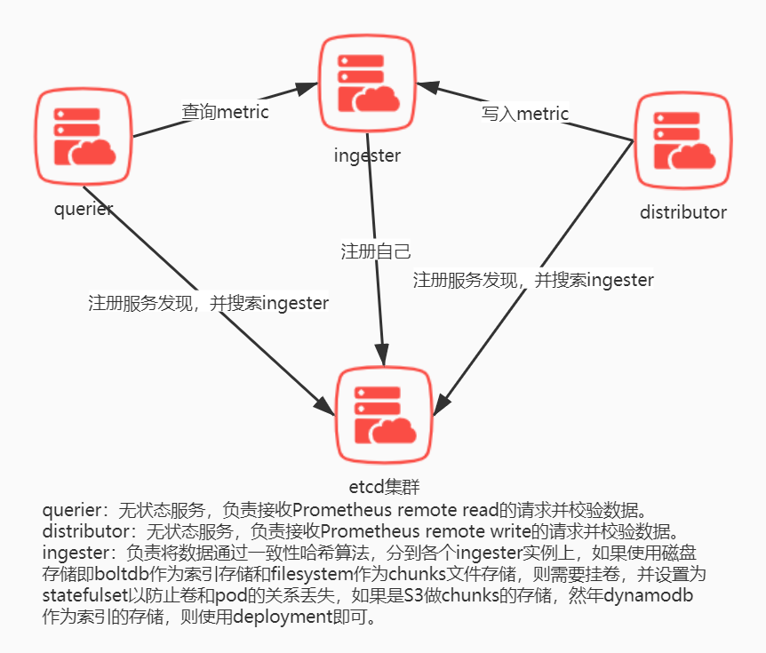
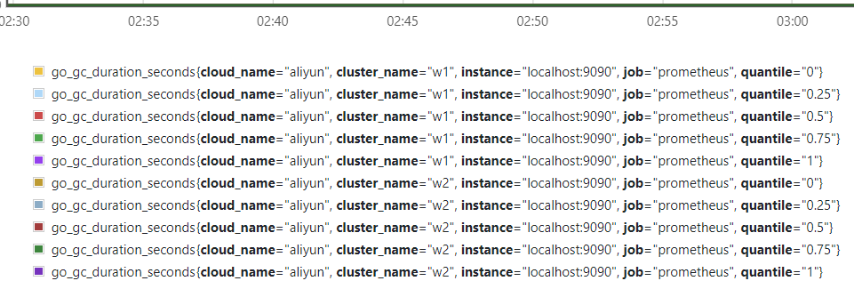
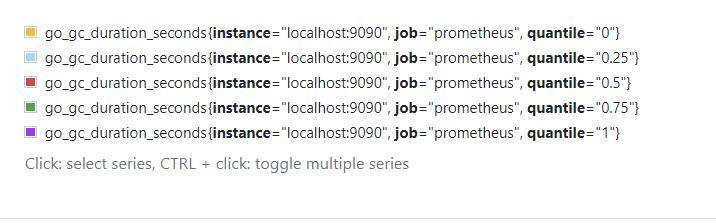
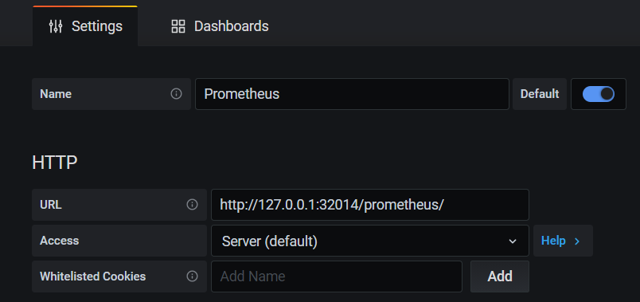
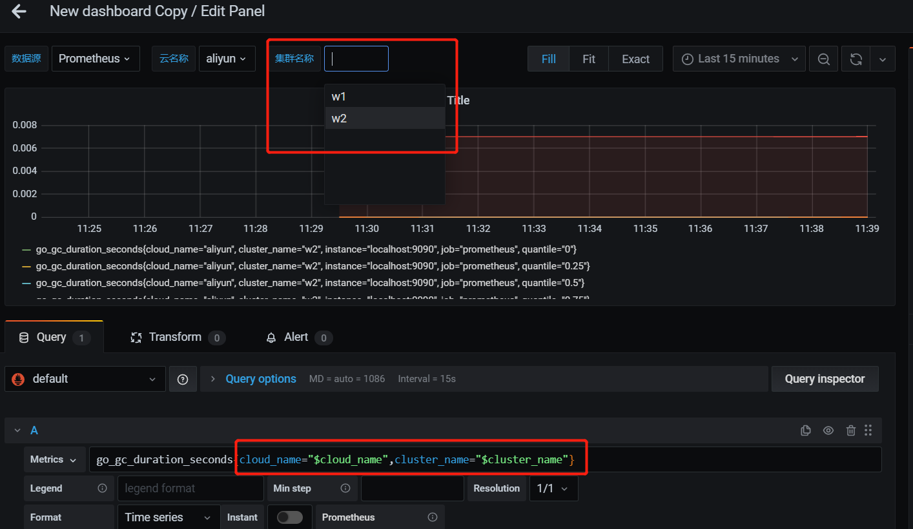
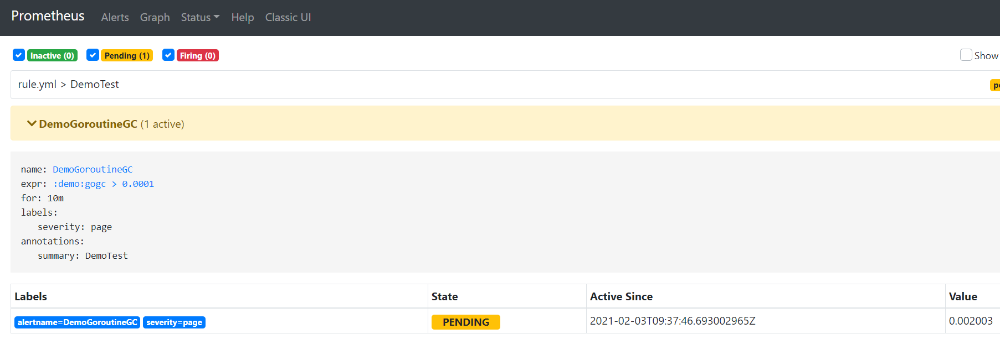

单个云的多个集群的Prometheus数据都汇集到一个cortex集群当中。如果是多个云，那么将cortex集群和grafana都放在香港以接收全球发来的数据，当然这种公网传输不一定靠得住。

如果是多个云的情况下每个云各自一套cortex，那么需要使用thanos将所有的cortex数据在查询的时候聚合起来，当前这是最蛋疼的方式，极度耗费流量且响应速度不会太快。

本文的目标是 一个grfana入口 管理所有集群的监控数据。告警仍然沿用Prometheus+alertmanager告警
<br>

### 总体预览（单云内多K8集群模式，客户监控数据不出国）



### 总体预览(多云，单数据库模式)

* #### 方案问题
    * 写入时的公网速度和流量问题
        * 理论解决方案：编写自定义的Prometheus remote adapter，在发给cortex的时候过滤掉我们不需要的metric数据，需要给出一个过滤列表。Prometheus主要是传输的信息量如label和metric名 这种非常占网络传输，单实际存储的时候只是保留了值。
        * 
### 总体预览(多云，多数据库模式，需要忍受龟速或数据冗余)
龟速版本

冗余加速版本

* #### 方案问题
    * #### 写入时的公网速度和流量问题
        * 理论解决方案：编写自定义的Prometheus remote adapter，在发给cortex的时候过滤掉我们不需要的metric数据，需要给出一个过滤列表。Prometheus主要是传输的信息量如label和metric名 这种非常占网络传输，单实际存储的时候只是保留了值。
    * #### 读取时速度的聚合查询结果的问题
        * 需要能够忍受龟速的传输速度，毕竟海外服务器到香港还是有很大的延迟，以全量采集cadvisor metrics为例，聚合一个64个节点的集群的数据，在grafana侧五分钟间隔的数据查询预计是12MB json传输量.
### prometheus 远程写入的坑
    多个remote adapter，Prometheus远程写入的时候使用了一个单http client，由于他启用了keep-alive参数，因此这个client会永远往 一个remote write adapter上写数据，需要修改源码禁用http keep-alive才能套用k8s的round-robin调度，官方的原意是为了加速写入减少http连接。
    
    在官方仓库changelog.md 中 Prometheus在1.8.0之后的版本 remote storage 的连接都使用了http keep-alive，修改方法，Prometheus 2.24.1的代码为例,注意看注释的新增代码几个字

```golang
/storage/remote/client.go
// NewWriteClient creates a new client for remote write.
func NewWriteClient(name string, conf *ClientConfig) (WriteClient, error) {
    httpClient, err := config_util.NewClientFromConfig(conf.HTTPClientConfig, "remote_storage_write_client", false, false)
    if err != nil {
        return nil, err
    }

    t := httpClient.Transport
    // 新增代码开始 。。。。
    if strings.TrimSpace(os.Getenv("REMOTE_WRITER_DISABLE_KEEP_ALIVE")) == "true" {
        t = &http.Transport{ // 他的其余参数都是复制的http.DefaultTransport
            Proxy: http.ProxyFromEnvironment,
            DialContext: (&net.Dialer{
                Timeout:   30 * time.Second,
                KeepAlive: 30 * time.Second,
                DualStack: true,
            }).DialContext,
            ForceAttemptHTTP2:     true,
            MaxIdleConns:          100,
            IdleConnTimeout:       90 * time.Second,
            TLSHandshakeTimeout:   10 * time.Second,
            ExpectContinueTimeout: 1 * time.Second,
            DisableKeepAlives:     true, // 这一行是新增的
        }
    }
    // 新增代码结束 。。。。

    httpClient.Transport = &nethttp.Transport{
        RoundTripper: t,
    }

    return &Client{
        remoteName: name,
        url:        conf.URL,
        Client:     httpClient,
        timeout:    time.Duration(conf.Timeout),
    }, nil
}
```
### 读写分离模式（Prometheus分角色，能解决全集群告警问题）
* #### 描述
    N个Prometheus分别采集不同的任务或相同任务，视数据量来定，如果数据量很大则采用不同Prometheus采集不同的任务，如果数据量小，则每个Prometheus都采集相同的任务。这种Prometheus不要配置任何的rule，只留下采集job，通过remote_write的方式写入到cortex存储中。
    
    这样的Prometheus简称PW 即Prometheus writer，他们只需要配置好remote_writer即可，且数据留存时间给1小时就够了，因为我们平时操作Prometheus ui 做查询和告警是在另一种Prometheus的webui上，即去PR（Prometheus Reader）的webui上操作。
    
    启用cortex ha去重功能来应对多Prometheus采集相同数据导致数据重复的问题。

    3个Prometheus 作为Prometheus reader，继承当前运维人员写的prometheus的alert rule和record rule，并启用告警功能推送给alertmanager。这种Prometheus不要配置任何采集job，通过remote_read的方式来读取数据，触发告警。

    3个alertmanager实例做集群保证高可用。

    为了防止节点故障，如果集群节点很多的情况下，建议设置pod反亲和以保证每个实例运行在不同的节点上。

* #### 为什么会如此蛋疼地设置两种Prometheus
    <span style="color:red;font-weight:bold;">因为Prometheus 的external label坑导致</span>。远程读取会使用external_labels作为label匹配条件

    prometheus2.14版本见于 /storage/remote/read.go#70 Select()函数 插入fmt.Println(query.String())

    打印一下查询条件就能看到
    
    这会引发问题：一个Prometheus在webgui上操作只能搜到自己的数据，搜不到其他集群其他Prometheus的数据。这就导致告警无法做到多集群数据的告警。

    其实cortex也有兼容Prometheus的alert rule 和 record rule 以及内嵌了一个 alertmanager，但本方案目前是做最小改动，因此放弃迁移到cortex。

    <span style="color:red;font-weight:bold;">再者如果从cortex换成其他Prometheus长期存储系统，诸如m3db或VictoriaMetrics也会比较方便，不至于一条路绑死在cortex上。</span>

# cortex集群
* 单体多实例模式（官方不推荐在生产环境，仅用于快速开始和开发）
* 微服务多实例模式
    * #### 最小模式
        
        * 这种模式下，索引的boltdb库内嵌在ingester中，filesystem存储chunk的代码也内嵌在ingester中。并且这两个存储都会在本地磁盘目录产生文件。
    * #### 最小化的S3存储chunk，dynamodb或者Cassandra做索引的存储
        * 和最小模式相似，只是ingester写入数据和读取数据的后端变成了dynamodb Cassandra S3了。
        * 如果有可能直接使用aws的dynamodb或者Cassandra也行，不过可能会产生费用成本，所以还是自己搭建就好。
        * 需要测试S3的写入和读取速度。
### 测试案例(grafana和Prometheus 对不同云和不同集群的数据区分与展示)
* #### 环境准备
    * cortex集群一个
    * prometheus-w1 作为Prometheus writer角色，配置remote writer写数据给cortex集群，配置external label为cluster_name: w1,cloud-name: aliyun
    * prometheus-w2 作为Prometheus writer角色，配置remote writer写数据给cortex集群，配置external label为cluster_name: w2,cloud-name: aliyun
    * prometheus-r 作为Prometheus reader角色，配置remote reader从cortex集群读取数据
* #### 在Prometheus reader上看到的数据
    
* #### 在任意Prometheus writer 上看到的数据（即使配置了remote_reader）
    
* #### 在grafana面板上将看到这样的数据
    
    
* ### 在Prometheus reader上运行的alert rule
    
