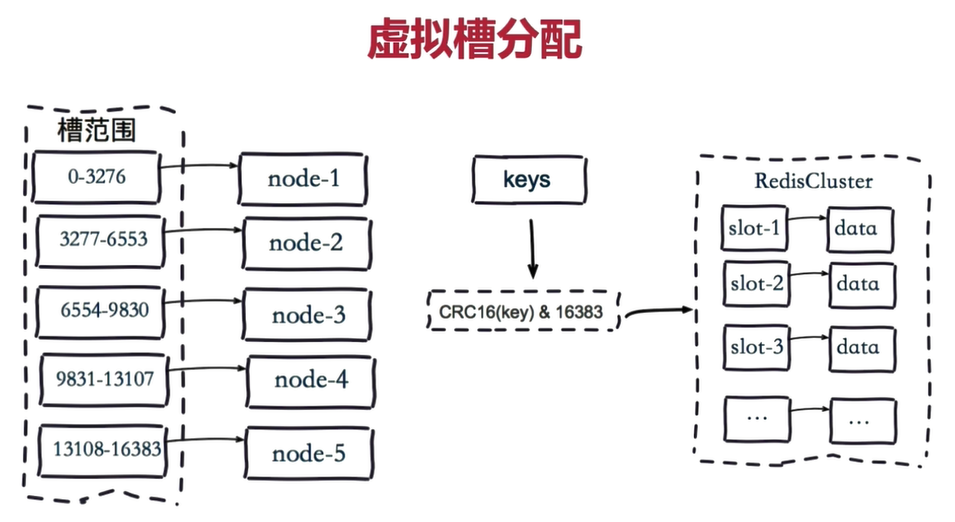
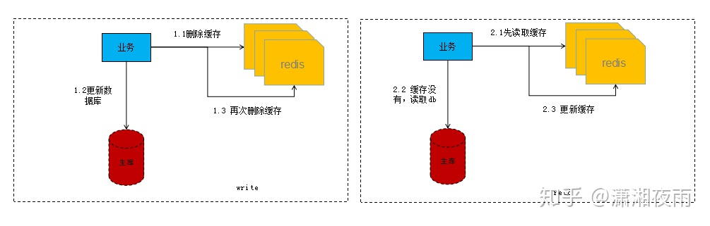
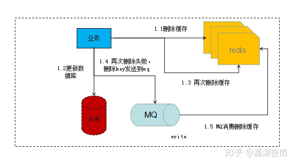

[缓存策略文章1](https://www.cnblogs.com/xichji/p/11286443.html) 
[缓存策略文章2](https://blog.csdn.net/fcvtb/article/details/89478554)

> ## 1.redis采用什么数据结构来索引数据？
    跳表skiplist,即多重链表，为什么使用跳表而不是B+树，是因为B+树本身是针对硬盘的一种数据结构，多重分段链表有利于快速区间查找，要比B+树快得多。

> ## 2.redis集群方案？
* ### 多重哨兵+redis
    这种方式缺点很明显，每个redis都是相同的数据且哨兵也需要哨兵容易套娃，优点是稳定性很好。
* ### redis-cluster-proxy + redis-cluster
    * #### 描述
        redis cluster模式需要各语言的sdk客户端做负载均衡以及保存redis的状态信息，而redis-cluster-proxy则完美解决了需要各类语言sdk做负载均衡的问题，只需要最基本的redis客户端就能完美地使用这个集群。
         
        如果客户端已经实现了状态管理即实现了redis smart client ，那么也可以不要redis-cluster-proxy
          
        redis集群一共有16384个槽，通过方式计算每个计算的槽范围段，通过crc16(key)&16384来计算当前key在哪个槽位范围段，redis集群主节点之间共享状态信息，其中就包括每个
        节点拥有哪些范围段的槽位.[文章引用](https://www.cnblogs.com/williamjie/p/11132211.html) 
        如果节点发现key不属于自己管理的范围段则会将key的操作转发给正确的范围段服务器。

        官方推荐最少六个节点，如果有A1、B1、C1三个节点的redis主节点服务器，那么必须有A2、B2、C2三个从节点（备用节点，挂了的时候替代主节点），A2是A1的从节点，以此类推。

    * ### redis如何分槽
        redis集群必须分槽后才能使用。使用redis提供的ruby工具 ./redis-trib.rb create --replicas masterIP1:6379 masterIP2:6379 ...
        * #### 错误情况 [ERR] Calling MIGRATE ERR Syntax error, try CLIENT (LIST | KILL | GETNAME | SETNAME | PAUSE | REPLY)
            [解决](https://blog.csdn.net/zhangyun75/article/details/80736131) : ruby gem安装的redis库，版本不能使用最新的4.0，否则redis-trib.rb reshard 192.168.2.106:8002 重新分片时会报错误。
    * ### redis cluster模式的选举 [文章引用](https://blog.csdn.net/truelove12358/article/details/79612954)
        * 投票过程是集群中所有master参与,如果半数以上master节点与master节点通信超时(cluster-node-timeout),认为当前master节点挂掉.
        * 如果任意master没有挂掉且没有slave接替，那么集群不可用。如果半数master挂掉，无论是否有slave接替都导致集群不可用？
> ## 4.redis和数据库的一致性如何保证？
* [文章引用](https://zhuanlan.zhihu.com/p/91770135)
* ### 懒加载模式
    
* ### 异步双删redis key
    
    1. 删除redis key
    2. 写入数据库
    3. 将删除redis key的操作推入消息队列系统
    4. 消息队列处理后端收到删除请求，删除redis key，然后其他线程再次刷新缓存。
    5. 一个缓存一定要设置超时时间来做双删第二次删除失败的补偿措施。
    6. 消息队列处理后端要多次尝试重新删除redis key
* ### 分布式锁
    1. 先申请一把分布式写锁将redis key锁住，防止赞数据被其他线程读取。虽然这造成了性能，但避免了后续删除缓存时的其他线程的脏写
    2. 写入数据库，如果成功则删redis，失败则解锁。
    3. 如果数据库和删除redis都成功了，要解锁。

> ## 5.redis缓存过期策略和内测淘汰策略？
* redis使用了两种过期策略，即第一种定期扫描过期key（定期），这种方式需要大量频繁扫描比较消耗CPU。第二种访问的时候判断key是否过期（惰性），这种方式导致key一直在内存里面比较占内存。
* Redis的内存淘汰策略是指在Redis的用于缓存的内存不足时，怎么处理需要新写入且需要申请额外空间的数据。[文章引用](https://www.jianshu.com/p/8aa619933ebb)
    * noeviction：当内存不足以容纳新写入数据时，新写入操作会报错。
    * allkeys-lru：当内存不足以容纳新写入数据时，在键空间中，移除最近最少使用的key。
    * allkeys-random：当内存不足以容纳新写入数据时，在键空间中，随机移除某个key。
    * volatile-lru：当内存不足以容纳新写入数据时，在设置了过期时间的键空间中，移除最近最少使用的key。
    * volatile-random：当内存不足以容纳新写入数据时，在设置了过期时间的键空间中，随机移除某个key。
    * volatile-ttl：当内存不足以容纳新写入数据时，在设置了过期时间的键空间中，有更早过期时间的key优先移除。
> ## 6.redis缓存击穿预防？
* ### 描述：
    * 缓存击穿是指缓存中没有但数据库中有的数据（一般是缓存时间到期），这时由于并发用户特别多，同时读缓存没读到数据，又同时去数据库去取数据，引起数据库压力瞬间增大，造成过大压力。
* ### 解决方案：
    * 设置热点数据永远不过期，并且后台定期刷新。
    * 单用户接口请求频率做限制
    * 加锁，发下能缓存不存在时候获取一把分布式锁，去读取数据，然后刷新redis缓存，获取锁之后 在判断一次redis是否已经有了，如果没有继续重复获取锁的操作直到超过最大重试获取锁的次数或者获取锁超时就返回错误。

> ## 7.redis雪崩预防？
* ### 描述：
    * 缓存雪崩是指缓存中数据大批量到过期时间，而查询数据量巨大，引起数据库压力过大甚至down机。和缓存击穿不同的是，缓存击穿指并发查同一条数据，缓存雪崩是不同数据都过期了，很多数据都查不到从而查数据库。
* ### 解决方案：
    * 缓存数据的过期时间设置随机，防止同一时间大量数据过期现象发生。
    * 如果缓存数据库是分布式部署，将热点数据均匀分布在不同搞得缓存数据库中。
    * 设置热点数据永远不过期。
    * 加锁，发下能缓存不存在时候获取一把分布式锁，去读取数据，然后刷新redis缓存，获取锁之后 在判断一次redis是否已经有了，如果没有继续重复获取锁的操作直到超过最大重试获取锁的次数或者获取锁超时就返回错误。

> ## 8.redis缓存穿透预防？
* ## 描述：
    * 缓存穿透是指缓存和数据库中都没有的数据，而用户不断发起请求。由于缓存是不命中时被动写的，并且出于容错考虑，如果从存储层查不到数据则不写入缓存，这将导致这个不存在的数据每次请求都要到存储层去查询，失去了缓存的意义。
     在流量大时，可能DB就挂掉了，要是有人利用不存在的key频繁攻击我们的应用，这就是漏洞。
     如发起为id为“-1”的数据或id为特别大不存在的数据。这时的用户很可能是攻击者，攻击会导致数据库压力过大。

* ## 解决方案：
    * 接口层增加校验，如用户鉴权校验，id做基础校验，id<=0的直接拦截；
     从缓存取不到的数据，在数据库中也没有取到，这时也可以将key-value对写为key-null，缓存有效时间可以设置短点，如30秒（设置太长会导致正常情况也没法使用）。这样可以防止攻击用户反复用同一个id暴力攻击

### 附录
    节点取余分片方式 hash(key) % ${node_count}